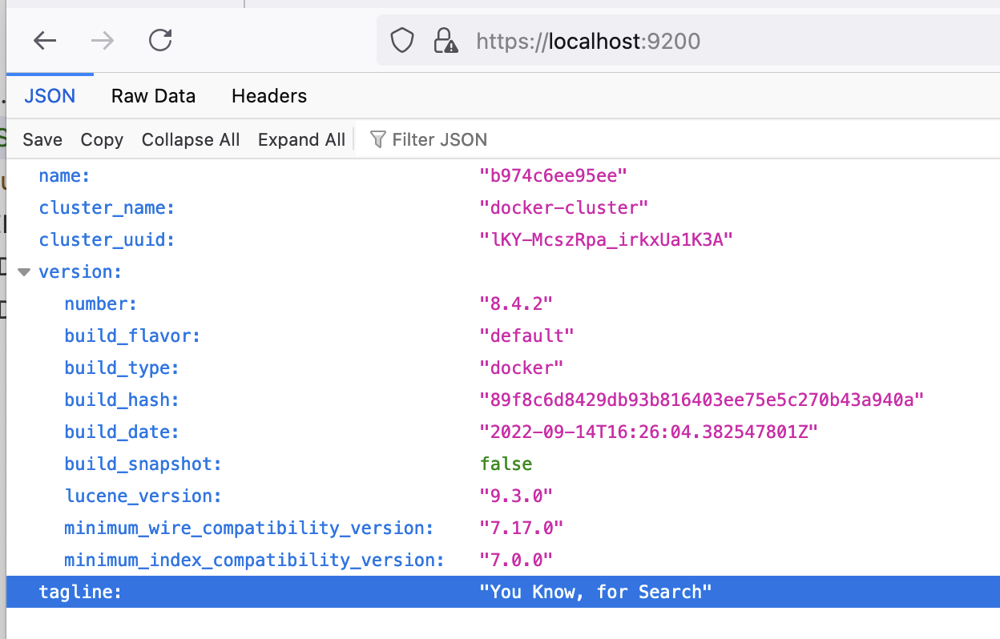
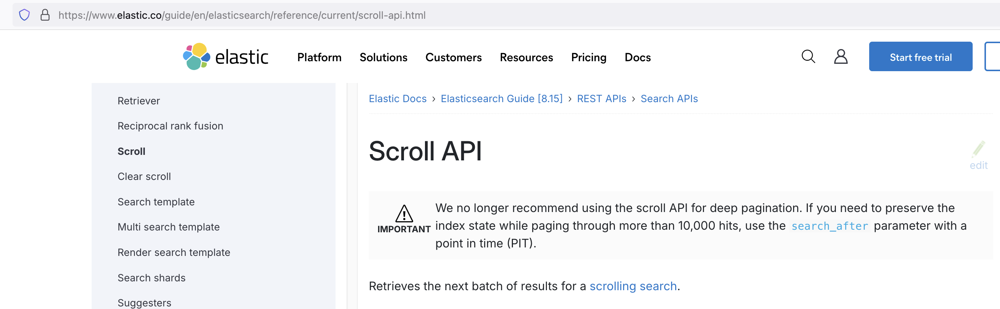

## Запуск Elasticsearch в контейнере

```sh
docker pull elasticsearch:8.4.2
```
```sh
# создаем сеть (на самом деле не обязательно нужна для общения контейнеров внути одной сети)
# создаем волюм чтобы хранить на нем данные между перезагрузками контейнера
# запускаем контейнер и монитруем волюм пробрасываем порты

docker network create somenetwork
docker volume create elasticsearch_data
docker run -d --name elasticsearch --net somenetwork -p 9200:9200 -p 9300:9300 -e "discovery.type=single-node" -v elasticsearch_data:/usr/share/elasticsearch/data elasticsearch:8.4.2
```
потом надо зайти в контейнер и 
```sh
bin/elasticsearch-reset-password -u elastic
```
там создаем пользователя с именем `elastic` и нам генерируют пароль.
// elasticsearch-certutil
копируем клиентский сертификат и проверяем коннект через `curl`
``` sh
docker cp <container_name>:/usr/share/elasticsearch/config/certs/http_ca.crt .
curl --cacert {path_to_http_ca.crt} -u {your_username}:{your_password} https://localhost:9200
```

он потребуется для коннекта через Go **[elasticsearch go-api](https://www.elastic.co/guide/en/elasticsearch/client/go-api/current/connecting.html#verifying-with-ca)**

и получаем примерно такой ответ: 
```json
{
  "name" : "adc9003f21ab",
  "cluster_name" : "docker-cluster",
  "cluster_uuid" : "R3Ra-AkmQ4a7qvcdfmFsLw",
  "version" : {
    "number" : "8.4.2",
    "build_flavor" : "default",
    "build_type" : "docker",
    "build_hash" : "89f8c6d8429db93b816403ee75e5c270b43a940a",
    "build_date" : "2022-09-14T16:26:04.382547801Z",
    "build_snapshot" : false,
    "lucene_version" : "9.3.0",
    "minimum_wire_compatibility_version" : "7.17.0",
    "minimum_index_compatibility_version" : "7.0.0"
  },
  "tagline" : "You Know, for Search"
}
```

потом в браузере заходим на <br> 
**https://localhost:9200** <br>
и логинимся elastic и пароль который который вам сгенерировало.
примерно такой вывод свидетельствует о том что запустилось и работает
<br>

<br>


Для использования пагинации нужно использовать не Scroll API
<br>

<br>

можно использовать обычный серч и серч афтер:
`https://localhost:9200/places/_search`<br>
body:
```json
{   
    "size":1000,
    "sort": [
        {"id":"asc"}
    ],
    "search_after": [
        16000
    ]
}
```
нужно так же использовать PIT для хранения положения скролла [[SEARCH AFTER]](https://www.elastic.co/guide/en/elasticsearch/reference/8.8/paginate-search-results.html#search-after)

для реализации доступа к произвольной странице следует использовать как я понял
`search_after` и `pit` и в цикле по количеству страниц и по размер страницы итерироваться нужное количество раз.