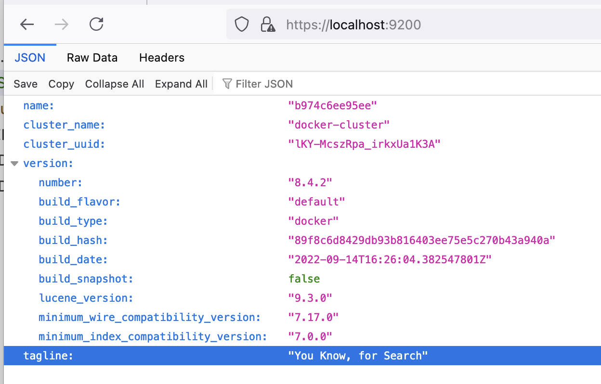

## Запуск Elasticsearch в контейнере

```sh
docker pull elasticsearch:8.4.2
```
```sh
# создаем сеть (на самом деле не обязательно нужна для общения контейнеров внути одной сети)
# создаем волюм чтобы хранить на нем данные между перезагрузками контейнера
# запускаем контейнер и монитруем волюм пробрасываем порты

docker network create somenetwork
docker volume create elasticsearch_data
docker run -d --name elasticsearch --net somenetwork -p 9200:9200 -p 9300:9300 -e "discovery.type=single-node" -v elasticsearch_data:/usr/share/elasticsearch/data elasticsearch:8.4.2
```
потом надо зайти в контейнер и 
```sh
bin/elasticsearch-reset-password -u elastic
```
там создаем пользователя с именем `elastic` и нам генерируют пароль.
потом в браузере заходим на <br> 
**https://localhost:9200** <br>
и логинимся elastic и пароль который который вам сгенерировало.
примерно такой вывод свидетельствует о том что запустилось и работает
<br>

<br>
